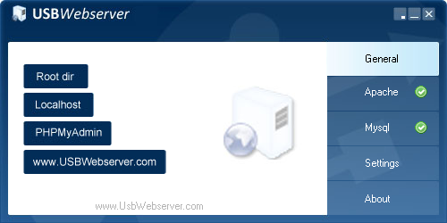
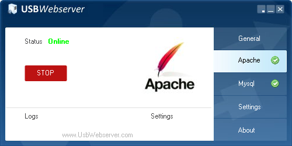
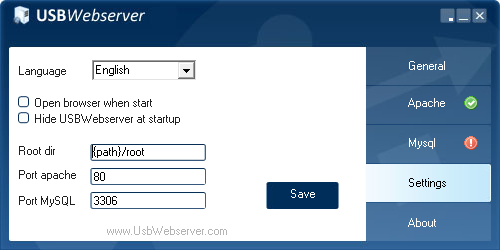

# Como configurar o USBWebServer para usar SQL Server 2022

Este procedimento mostra como configurar o **USBWebserver** com **PHP 8.1.3** para conectar ao **SQL Server 2022** usando a extensão oficial `sqlsrv` da Microsoft.

---

## 🔧 Requisitos

- USBWebserver com PHP 8.1.3 (Thread Safe)
- SQL Server 2022 instalado e em execução
- Windows (x86) com Visual C++ Redistributable 2019 instalado

---

## 🖥️ Instalar o USBWebserver

1. Acesse o site abaixo para baixar o USBWebserver:
   - [USBWebserver 8.6.5 (PHP 8.1.3)](https://usbwebserver.yura.mk.ua/index.php)
   - [USBWebserver 10 (PHP 8.1.7)](https://sourceforge.net/projects/usbwebserver/)


2. Extraia o conteúdo do `.zip` para um diretório de sua preferência, por exemplo:

    ```
    C:\USBWebserver
    ```

3. Execute o arquivo `USBWebserver.exe`.

4. A interface principal será carregada. Verifique se o `Apache` está ativo.





Como não iremos usar o `MySQL`, você pode parar o serviço:


Na Aba `Settings`, você pode configurar a porta do Apache e o caminho da pasta raiz do seu projeto PHP.




5. O diretório raiz (`root`) dos seus arquivos `*.php` fica em:

    ```
    C:\USBWebserver\root
    ```


6. Para acessar seus arquivos no navegador, use:

    🔗 [http://localhost/](http://localhost/)


---

## 📁 Passo 1 – Baixar as extensões do SQLSRV

1. Acesse: https://learn.microsoft.com/pt-br/sql/connect/php/download-drivers-php-sql-server
2. Baixe o driver correspondente à versão do seu PHP (ex: `8.1` **Thread Safe**, x86).
   - Nome dos arquivos: `php_sqlsrv_81_ts.dll` e `php_pdo_sqlsrv_81_ts.dll`

---

## 📦 Passo 2 – Copiar as DLLs para o USBWebserver

1. Copie os arquivos `.dll` para a pasta:
   ```
   C:\USBWebserver\php\ext\
   ```

    Caso você tenha instalado o USBWebserver no disco C:\ na pasta USBWebServer, o caminho completo seria:

```
    .
    ├── apache2
    │   ├── bin
    │   ├── cgi-bin
    │   ├── conf
    │   ├── logs
    │   └── modules
    ├── lang
    ├── mysql
    │   ├── bin
    │   ├── data
    │   └── share
    ├── php
    │   └── ext  <==== COPIAR AS DLLS AQUI
    ├── phpmyadmin
    │   ├── js
    │   ├── libraries
    │   ├── locale
    │   ├── templates
    │   ├── themes
    │   ├── tmp
    │   └── vendor
    ├── root
    │   └── app
    └── settings
```    


2. Copie também os arquivos `msodbcsql17.dll` e `msvc*` se forem exigidos, ou instale o [ODBC Driver 17 para SQL Server](https://learn.microsoft.com/pt-br/sql/connect/odbc/download-odbc-driver-for-sql-server).

OBS: Caso você já tenha instalado o [SSMS (SQL Server Management Studio)](https://learn.microsoft.com/pt-br/ssms/install/install), este item já vai estar OK.
---

## ⚙️ Passo 3 – Ativar as extensões do SQL Server no `php.ini`

1. Edite o arquivo:
   ```
   C:\USBWebserver\settings\php.ini
   ```

2. Adicione as linhas abaixo ao final da seção de extensões:

    ```
    extension=php_sqlsrv_81_ts_x86.dll
    extension=php_pdo_sqlsrv_81_ts_x86.dll
    ```

    No `php.ini` vai ficar mais ou menos parecido com isso:


    ```ini
    ; Windows Extensions
    ; Note that ODBC support is built in, so no dll is needed for it.
    ; Note that many DLL files are located in the extensions/ (PHP 4) ext/ (PHP 5+)
    ; extension folders as well as the separate PECL DLL download (PHP 5+).
    ; Be sure to appropriately set the extension_dir directive.
    ;
    ;extension=php_bz2.dll
    extension=php_curl.dll
    ;extension=php_fileinfo.dll
    ;extension=php_ftp.dll
    extension=php_gd2.dll
    ;extension=php_gettext.dll
    ;extension=php_gmp.dll
    ;extension=php_intl.dll
    extension=php_imap.dll
    ;extension=php_interbase.dll
    ;extension=php_ldap.dll
    extension=php_mbstring.dll
    extension=php_exif.dll      ; Must be after mbstring as it depends on it
    extension=php_mysqli.dll
    ;extension=php_oci8_12c.dll  ; Use with Oracle Database 12c Instant Client
    extension=php_openssl.dll
    ;extension=php_pdo_firebird.dll
    extension=php_pdo_mysql.dll
    ;extension=php_pdo_oci.dll
    ;extension=php_pdo_odbc.dll
    extension=php_pdo_pgsql.dll
    extension=php_pdo_sqlite.dll
    ;extension=php_pgsql.dll
    ;extension=php_shmop.dll
    extension=php_sqlsrv_81_ts_x86.dll       <== ADICIONAR AQUI
    extension=php_pdo_sqlsrv_81_ts_x86.dll   <== ADICIONAR AQUI

    ```

---

## 🔄 Passo 4 – Reiniciar o USBWebserver

- Feche e abra novamente o USBWebserver para recarregar o PHP com as extensões habilitadas.

---

## ✅ Passo 5 – Testar conexão com SQL Server

Crie um arquivo chamado `teste_conexao_sqlsrv.php` dentro da pasta `root` do USBWebserver com o conteúdo:

```php
<?php
$serverName = "localhost"; // ou IP, ou NOME\INSTANCIA
$connectionOptions = [
    "Database" => "sua_base",
    "Uid" => "seu_usuario",
    "PWD" => "sua_senha",
];

$conn = sqlsrv_connect($serverName, $connectionOptions);
if ($conn) {
    echo "✅ Conexão com SQL Server bem-sucedida!";
} else {
    echo "❌ Falha na conexão.";
    print_r(sqlsrv_errors());
}
?>
```

---

## 🧪 Verifique no `phpinfo()`

- Acesse um arquivo PHP com `phpinfo();` e verifique se `sqlsrv` e `pdo_sqlsrv` aparecem listadas como extensões ativas.

---

## 🛠 Dicas adicionais

- O SQL Server deve estar com o protocolo **TCP/IP habilitado** no Configuration Manager.
- Verifique se a porta (padrão: `1433`) está acessível.
- O login SQL deve estar habilitado no modo de autenticação (mistura SQL Server + Windows).
- Para validar o se PHP carregou as extensões do SQL Server, abra um prompt do Windows e digite o comando abaixo:

```
cd C:\usbwebserver\php
php -m
```

Deverá aparecer uma lista similar a essa:

```
PS C:\usbwebserver\php> .\php -m
PHP Warning:  PHP Startup: Unable to load dynamic library 'php_gd2.dll' (tried: C:/usbwebserver\php\ext\php_gd2.dll (Não foi possível encontrar o módulo especificado), C:/usbwebserver\php\ext\php_php_gd2.dll.dll (Não foi possível encontrar o módulo especificado)) in Unknown on line 0
[PHP Modules]
bcmath
calendar
Core
ctype
curl
date
dom
exif
filter
hash
iconv
imap
json
libxml
mbstring
mysqli
mysqlnd
openssl
pcre
PDO
pdo_mysql
pdo_pgsql
pdo_sqlite
pdo_sqlsrv  <=== VALIDAR AQUI
Phar
readline
Reflection
session
SimpleXML
soap
sockets
SPL
sqlite3
sqlsrv      <=== E AQUI
standard
tidy
tokenizer
xml
xmlreader
xmlwriter
zip
zlib

[Zend Modules]
```

Se não aparecer sqlsrv ou der erro como "Unable to load dynamic library", significa que:

- O `.dll` está corrompido
- Está na arquitetura errada (ex: você pegou `x64` em vez de `x86` ou vice-versa)
- Faltam dependências do sistema (como ODBC 17)

## 🧩 BÔNUS: Criando uma instância SQL Server (Docker ou Azure)

Você pode utilizar uma instância SQL Server local com Docker ou criar uma instância na nuvem via Azure utilizando o repositório [`jlsilva01/sql-azure`](https://github.com/jlsilva01/sql-azure).

---

### 🔹 Opção 1: SQL Server local com Docker (Windows)

> Requer o [Docker Desktop](https://www.docker.com/products/docker-desktop/) instalado e em execução no Windows.

Execute o comando abaixo para criar um contêiner com SQL Server 2022:

```bash
docker run -e "ACCEPT_EULA=Y" -e "SA_PASSWORD=Str0ng!Passw0rd" -p 1433:1433 --name sqlserver2022 -d mcr.microsoft.com/mssql/server:2022-latest
```

📌 Parâmetros de conexão padrão:

Servidor: localhost
Porta: 1433
Usuário: sa
Senha: Str0ng!Passw0rd

Você pode conectar ao servidor SQL Server criado pelo docker através do [SSMS (SQL Server Management Studio)](https://learn.microsoft.com/pt-br/ssms/install/install).

 ### 🔹 Opção 2: SQL Server no Azure via Terraform

Repositório: 🔗 [jlsilva01/sql-azure](https://github.com/jlsilva01/sql-azure)