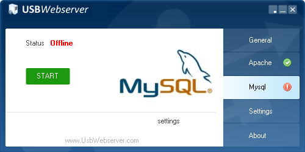

# Como configurar o USBWebServer para usar SQL Server 2022

Este procedimento mostra como configurar o **USBWebserver** com **PHP 8.1.3** para conectar ao **SQL Server 2022** usando a extensão oficial `sqlsrv` da Microsoft.

---

## 🔧 Requisitos

- USBWebserver com PHP 8.1.3 (Thread Safe)
- SQL Server 2022 instalado e em execução
- Windows (x86) com Visual C++ Redistributable 2019 instalado

---

## 🖥️ Instalar o USBWebserver

1. Acesse o site abaixo para baixar o USBWebserver:
   - [USBWebserver 8.6.5 (PHP 8.1.3)](https://usbwebserver.yura.mk.ua/index.php)
   - [USBWebserver 10 (PHP 8.1.7)](https://sourceforge.net/projects/usbwebserver/)


2. Extraia o conteúdo do `.zip` para um diretório de sua preferência, por exemplo:

    ```
    C:\USBWebserver
    ```

3. Execute o arquivo `USBWebserver.exe`.

4. A interface principal será carregada. Verifique se o `Apache` está ativo.


Como não iremos usar o `MySQL`, você pode parar o serviço:



Na Aba `Settings`, você pode configurar a porta do Apache e o caminho da pasta raiz do seu projeto PHP.


5. O diretório raiz (`root`) dos seus arquivos fica em:

    ```
    C:\USBWebserver\root
    ```


6. Para acessar seus arquivos no navegador, use:

    🔗 [http://localhost/](http://localhost/)


---

## 📁 Passo 1 – Baixar as extensões do SQLSRV

1. Acesse: https://learn.microsoft.com/pt-br/sql/connect/php/download-drivers-php-sql-server
2. Baixe o driver correspondente à versão do seu PHP (ex: `8.1` **Thread Safe**, x86).
   - Nome dos arquivos: `php_sqlsrv_81_ts.dll` e `php_pdo_sqlsrv_81_ts.dll`

---

## 📦 Passo 2 – Copiar as DLLs para o USBWebserver

1. Copie os arquivos `.dll` para a pasta:
   ```
   USBWebserver\php\ext\
   ```

    Caso você tenha instalado o USBWebserver no disco C:\ na pasta USBWebServer, o caminho completo seria:

    .
    ├── apache2
    │   ├── bin
    │   ├── cgi-bin
    │   ├── conf
    │   ├── logs
    │   └── modules
    ├── lang
    ├── mysql
    │   ├── bin
    │   ├── data
    │   └── share
    ├── php
    │   └── ext  <==== COPIAR AS DLLS AQUI
    ├── phpmyadmin
    │   ├── js
    │   ├── libraries
    │   ├── locale
    │   ├── templates
    │   ├── themes
    │   ├── tmp
    │   └── vendor
    ├── root
    │   └── app
    └── settings
    


2. Copie também os arquivos `msodbcsql17.dll` e `msvc*` se forem exigidos, ou instale o [ODBC Driver 17 para SQL Server](https://learn.microsoft.com/pt-br/sql/connect/odbc/download-odbc-driver-for-sql-server).

---

## ⚙️ Passo 3 – Ativar as extensões no `php.ini`

1. Edite o arquivo:
   ```
   C:\USBWebserver\settings\php.ini
   ```

2. Adicione as linhas abaixo ao final da seção de extensões:
   ```ini
    ; Windows Extensions
    ; Note that ODBC support is built in, so no dll is needed for it.
    ; Note that many DLL files are located in the extensions/ (PHP 4) ext/ (PHP 5+)
    ; extension folders as well as the separate PECL DLL download (PHP 5+).
    ; Be sure to appropriately set the extension_dir directive.
    ;
    ;extension=php_bz2.dll
    extension=php_curl.dll
    ;extension=php_fileinfo.dll
    ;extension=php_ftp.dll
    extension=php_gd2.dll
    ;extension=php_gettext.dll
    ;extension=php_gmp.dll
    ;extension=php_intl.dll
    extension=php_imap.dll
    ;extension=php_interbase.dll
    ;extension=php_ldap.dll
    extension=php_mbstring.dll
    extension=php_exif.dll      ; Must be after mbstring as it depends on it
    extension=php_mysqli.dll
    ;extension=php_oci8_12c.dll  ; Use with Oracle Database 12c Instant Client
    extension=php_openssl.dll
    ;extension=php_pdo_firebird.dll
    extension=php_pdo_mysql.dll
    ;extension=php_pdo_oci.dll
    ;extension=php_pdo_odbc.dll
    extension=php_pdo_pgsql.dll
    extension=php_pdo_sqlite.dll
    ;extension=php_pgsql.dll
    ;extension=php_shmop.dll
    extension=php_sqlsrv_81_ts_x86.dll       <== ADICIONAR AQUI
    extension=php_pdo_sqlsrv_81_ts_x86.dll   <== ADICIONAR AQUI

    ```

---

## 🔄 Passo 4 – Reiniciar o USBWebserver

- Feche e abra novamente o USBWebserver para recarregar o PHP com as extensões habilitadas.

---

## ✅ Passo 5 – Testar conexão com SQL Server

Crie um arquivo chamado `teste_conexao_sqlsrv.php` dentro da pasta `root` do USBWebserver com o conteúdo:

```php
<?php
$serverName = "localhost"; // ou IP, ou NOME\INSTANCIA
$connectionOptions = [
    "Database" => "sua_base",
    "Uid" => "seu_usuario",
    "PWD" => "sua_senha",
];

$conn = sqlsrv_connect($serverName, $connectionOptions);
if ($conn) {
    echo "✅ Conexão com SQL Server bem-sucedida!";
} else {
    echo "❌ Falha na conexão.";
    print_r(sqlsrv_errors());
}
?>
```

---

## 🧪 Verifique no `phpinfo()`

- Acesse um arquivo PHP com `phpinfo();` e verifique se `sqlsrv` e `pdo_sqlsrv` aparecem listadas como extensões ativas.

---

## 🛠 Dicas adicionais

- O SQL Server deve estar com o protocolo **TCP/IP habilitado** no Configuration Manager.
- Verifique se a porta (padrão: `1433`) está acessível.
- O login SQL deve estar habilitado no modo de autenticação (mistura SQL Server + Windows).
- Para validar o se PHP carregou as extensões do SQL Server, abra um prompt do Windows e digite o comando abaixo:

```
cd C:\usbwebserver\php
php -m
```

Se não aparecer sqlsrv ou der erro como "Unable to load dynamic library", significa que:

- O `.dll` está corrompido
- Está na arquitetura errada (ex: você pegou `x64` em vez de `x86`)
- Faltam dependências do sistema (como ODBC 17)